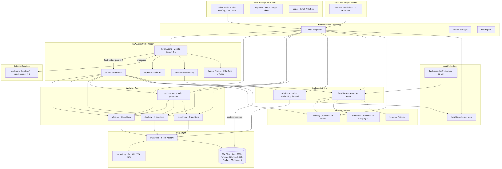
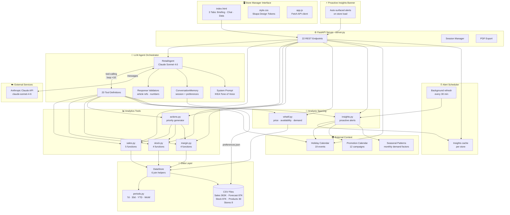

# Hej Assistant — Architecture

> An AI-powered daily commercial briefing and Q&A tool for IKEA store managers.

## Target Architecture


The diagram above shows the full target vision. Below we map each component to what is implemented.

## System Architecture (Current)



---

## System Overview



---

## Context

**Hej Assistant** is a GenAI prototype built for the IKEA RiverHacks hackathon. It gives IKEA store managers a single interface to:

1. **Get a daily AI-generated commercial briefing** — sales performance, stock health, margin analysis, and prioritised actions.
2. **Ask follow-up questions** — conversational Q&A backed by real store data and Claude tool-calling. Supports what-if scenarios via chat (price changes, availability, demand surges).
3. **Receive proactive alerts** — auto-surfaced insights on store load, refreshed every 30 minutes.
4. **Explore data** — interactive tables for top articles, HFB performance, stock alerts, and more.

The system runs as a single deployable unit on Railway (FastAPI + static HTML) and calls the Anthropic Claude API for LLM capabilities.

---

## Components

### Layer 1 — Store Manager Interface

| Component | Path | Description |
|---|---|---|
| HTML page | `src/static/index.html` | Single-page app with sidebar (store selector, metrics) and 3 tabs |
| Skapa CSS | `src/static/style.css` | IKEA Skapa design tokens — colours, spacing, typography, component styles |
| App logic | `src/static/app.js` | Fetch-based API client, tab navigation, markdown rendering, data tables |

**Features:**
- Store selector dropdown (8 IKEA stores)
- Snapshot cards (7d/30d sales, stock health, margin)
- ⚡ **Proactive insights banner** — auto-surfaces critical alerts on store load
- AI report generation with PDF export
- Chat with suggestion chips, session management, and what-if analysis via conversation
- Data explorer with 6 views and period filters

### Layer 2 — FastAPI Server

| Component | Path | Description |
|---|---|---|
| Server | `src/server.py` | FastAPI app with CORS, static file serving, all API endpoints |

**API Endpoints (22 total):**

| Method | Endpoint | Purpose |
|---|---|---|
| `GET` | `/api/health` | Health check + data date |
| `GET` | `/api/stores` | List all stores |
| `GET` | `/api/snapshot/{bu_sk}` | KPI snapshot (sales, stock, margin) |
| `GET` | `/api/top-articles/{bu_sk}` | Top-selling articles |
| `GET` | `/api/hfb-performance/{bu_sk}` | HFB performance breakdown |
| `GET` | `/api/stock-alerts/{bu_sk}` | Stock status (OOS, low, healthy) |
| `GET` | `/api/availability-risks/{bu_sk}` | Burn-rate based OOS predictions |
| `GET` | `/api/declining-articles/{bu_sk}` | Week-over-week declining articles |
| `GET` | `/api/daily-priorities/{bu_sk}` | AI-ranked daily action list |
| `GET` | `/api/margin/{bu_sk}` | Margin analysis |
| `GET` | `/api/insights/{bu_sk}` | Proactive insights (cached by scheduler) |
| `GET` | `/api/external-context/{bu_sk}` | Holidays, promotions, seasonal context |
| `GET` | `/api/whatif/availability/{bu_sk}` | Revenue uplift from fixing OOS |
| `GET` | `/api/memory/preferences/{bu_sk}` | Get user preferences |
| `POST` | `/api/report` | Generate AI daily briefing |
| `POST` | `/api/chat` | Conversational Q&A |
| `POST` | `/api/chat/reset` | Reset chat session |
| `POST` | `/api/export-pdf` | Export briefing as PDF |
| `POST` | `/api/whatif/price/{bu_sk}` | Price change simulation |
| `POST` | `/api/whatif/demand/{bu_sk}` | Demand surge stress test |
| `POST` | `/api/memory/preferences/{bu_sk}` | Set user preferences |

### Layer 3 — LLM Agent Orchestrator

| Component | Path | Description |
|---|---|---|
| Agent | `src/llm/agent.py` | `RetailAgent` class — Claude conversation with tool-calling loop (max 10 rounds), critic-refine-evaluate for reports |
| Prompts | `src/llm/prompts.py` | System prompt (IKEA retail expert persona), report template, 20 tool schemas |
| Validators | `src/llm/validators.py` | Post-generation checks: article name verification, number reasonableness |
| Memory | `src/llm/memory.py` | `ConversationMemory` — session history + persistent preferences (JSON-backed) |
| Scheduler | `src/llm/scheduler.py` | `AlertScheduler` — pre-computes proactive insights on 30-min refresh cycle |

**How the agent works:**

1. User sends a message (or report request)
2. `RetailAgent` sends the message + tool definitions to Claude
3. Claude decides which tools to call (e.g., `get_sales_summary`, `get_stock_alerts`)
4. Agent executes tools against real store data, returns results to Claude
5. Claude synthesises a natural-language response using IKEA tone of voice
6. Validators check the response for accuracy
7. Response returned to the frontend

**Tool inventory (20 tools):**

| Tool | Module | What it analyses |
|---|---|---|
| `get_sales_summary` | `sales.py` | 7d, 30d, YTD sales overview |
| `get_sales_vs_forecast` | `sales.py` | Actual vs forecast comparison |
| `get_top_articles` | `sales.py` | Top N by sales or profit |
| `get_hfb_performance` | `sales.py` | HFB breakdown with WoW growth |
| `get_declining_articles` | `sales.py` | Week-over-week decliners |
| `get_stock_alerts` | `stock.py` | OOS / low / healthy counts |
| `get_availability_risks` | `stock.py` | Burn rate → days until OOS |
| `get_oos_top_sellers` | `stock.py` | Top sellers with stock issues |
| `get_overstock_articles` | `stock.py` | Overstocked items |
| `get_margin_analysis` | `margin.py` | Gross margin breakdown |
| `get_top_profitable_articles` | `margin.py` | Highest margin articles |
| `get_low_margin_alerts` | `margin.py` | Below-threshold margin items |
| `get_hfb_margin_analysis` | `margin.py` | Margin by HFB |
| `generate_daily_priorities` | `actions.py` | Ranked action list combining all signals |
| `get_store_context` | `external_context.py` | Holidays, promotions, seasonal patterns |
| `get_proactive_insights` | `insights.py` | Auto-generated alerts across all dimensions |
| `whatif_price_change` | `whatif.py` | Price elasticity simulation |
| `whatif_availability_improvement` | `whatif.py` | Revenue uplift from fixing OOS |
| `whatif_demand_surge` | `whatif.py` | Stock stress test under demand increase |

### Layer 4 — Analysis Sparring & External Context

| Component | Path | Description |
|---|---|---|
| What-If | `src/tools/whatif.py` | Price change (elasticity -1.5), availability uplift, demand surge scenarios |
| Insights | `src/tools/insights.py` | Proactive alert engine combining all signals + external context |
| External | `src/tools/external_context.py` | 19 holidays, 12 promo campaigns, seasonal demand factors (0.8–1.4×), store regions |

### Layer 5 — Data Layer

| Component | Path | Description |
|---|---|---|
| DataStore | `src/data/loader.py` | Loads 5 CSVs, provides join helpers, mixed-date parsing |
| Periods | `src/data/periods.py` | Time filters: `last_7_days`, `last_30_days`, `ytd`, `previous_period` |

**Data sources (CSV):**

| File | Rows | Key columns |
|---|---|---|
| `data/Sales.csv` | ~363K | transaction_date, item_no, bu_sk, qty, net_amount, margin |
| `data/Forecast.csv` | ~87K | forecast_date, item_no, bu_sk, forecasted_qty |
| `data/Stock.csv` | ~87K | snapshot_date, item_sk, bu_sk, available_stock, demand_stock |
| `data/Product.csv` | ~30 | item_no, item_sk, series, description, colour, HFB |
| `data/Business_Unit.csv` | 8 | bu_sk, bu_name, bu_short_name, city |

**Date range:** 2024-01-01 to 2024-12-30 · `today` = max date in sales data

---

## Architecture Mapping: Target → Implementation

| Target Component | Status | Implementation |
|---|---|---|
| **Store manager interface** | ✅ Built | `src/static/` — HTML/CSS/JS with Skapa design, 3 tabs |
| **LLM agent orchestrator** | ✅ Built | `src/llm/agent.py` — Claude tool-calling with 20 tools, critic-refine loop |
| **Q&A engine** | ✅ Built | `/api/chat` — conversational Q&A with store context and memory |
| **Analysis sparring** | ✅ Built | `src/tools/whatif.py` — price, availability, demand surge simulations (via chat) |
| **Proactive insights** | ✅ Built | `src/tools/insights.py` — auto-surfaced on load via insights banner |
| **Conversation memory** | ✅ Built | `src/llm/memory.py` — session history + persistent JSON preferences |
| **Analytics tools** | ✅ Built | `src/tools/` — sales, stock, margin, actions (17 analysis functions) |
| **Alert scheduler** | ✅ Built | `src/llm/scheduler.py` — background 30-min refresh, pre-warmed cache |
| **Forecast data store** | ✅ Built | CSV-based with demand, accuracy via forecast vs actual |
| **Vector knowledge base** | ❌ Roadmap | No embeddings or document retrieval |
| **External context** | ✅ Built | `src/tools/external_context.py` — holidays, promos, seasonal patterns |

---

## Deployment

```
Railway (Nixpacks)
├── Procfile          → cd src && uvicorn server:app --host 0.0.0.0 --port $PORT
├── railway.json      → health check on /api/health
├── requirements.txt  → fastapi, uvicorn, anthropic, pandas, fpdf2, python-dotenv
└── .python-version   → 3.11
```

**Environment variables:**

| Variable | Required | Description |
|---|---|---|
| `ANTHROPIC_API_KEY` | Yes | Claude API key for LLM features |
| `PORT` | Auto | Set by Railway |

---

## Design Decisions

- **Single deployable unit** — no microservices; FastAPI serves both API and static files for simplicity at hackathon scale.
- **CSV over database** — data is small (< 1M rows total), pre-loaded at startup into pandas DataFrames for fast analysis.
- **Tool-calling over RAG** — Claude decides which analysis to run based on the user's question, rather than retrieving from a vector store. More deterministic and auditable.
- **Skapa design tokens only** — we use IKEA's CSS variables directly instead of the `@ingka` npm packages (which require internal registry access).
- **Session + persistent memory** — conversation history is session-scoped; user preferences persist in JSON across sessions.
- **Pre-computed insights** — Alert scheduler generates insights at startup and refreshes every 30 minutes, so page loads are instant.
- **Price elasticity heuristic** — what-if price simulations use a -1.5 elasticity factor (1% price increase → 1.5% volume decrease), a reasonable default for home furnishing.

---

## Roadmap (Post-Hackathon)

| Priority | Feature | Description |
|---|---|---|
| 🔴 High | **Vector knowledge base** | Embed SOPs, playbooks, corporate guidelines for RAG-based retrieval |
| 🟡 Medium | **Real external APIs** | Replace static calendars with live holiday/promo/weather API integrations |
| 🟡 Medium | **User authentication** | Store-level login to enable personalised preferences and audit trails |
| 🟢 Low | **Multi-language support** | Localise UI and LLM responses per store region |
| 🟢 Low | **Chart visualisations** | Add Chart.js or similar for trend visualisation in reports and explorer |
