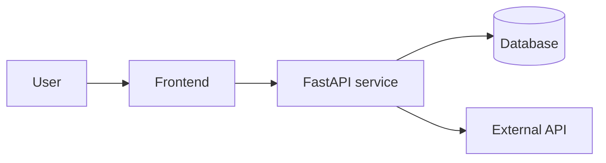

# Architecture

Replace this file with a real overview of your system. Keep it short:
agents do not read multi-page documents on every turn.

## Context

One paragraph: what does this repo do, for whom, and where does it sit in
the wider stack?

## Components

| Component | Path | Responsibility |
|---|---|---|
| Service A | `src/service_a/` | What it owns |
| Service B | `src/service_b/` | What it owns |
| Data store | (external) | Schema and ownership |

## High-level diagram

Replace the diagram with the real one. Mermaid renders in GitHub and most
IDE previews, so the agent can read it as text and humans can read it as a
picture.

## Boundaries and contracts

- What is public API vs internal?
- Which schemas are owned here vs consumed from elsewhere?
- Which jobs / queues / events does this repo produce or consume?

## Non-goals

State what this repo does **not** do. This is often more useful to an
agent than another paragraph about what it does do.
